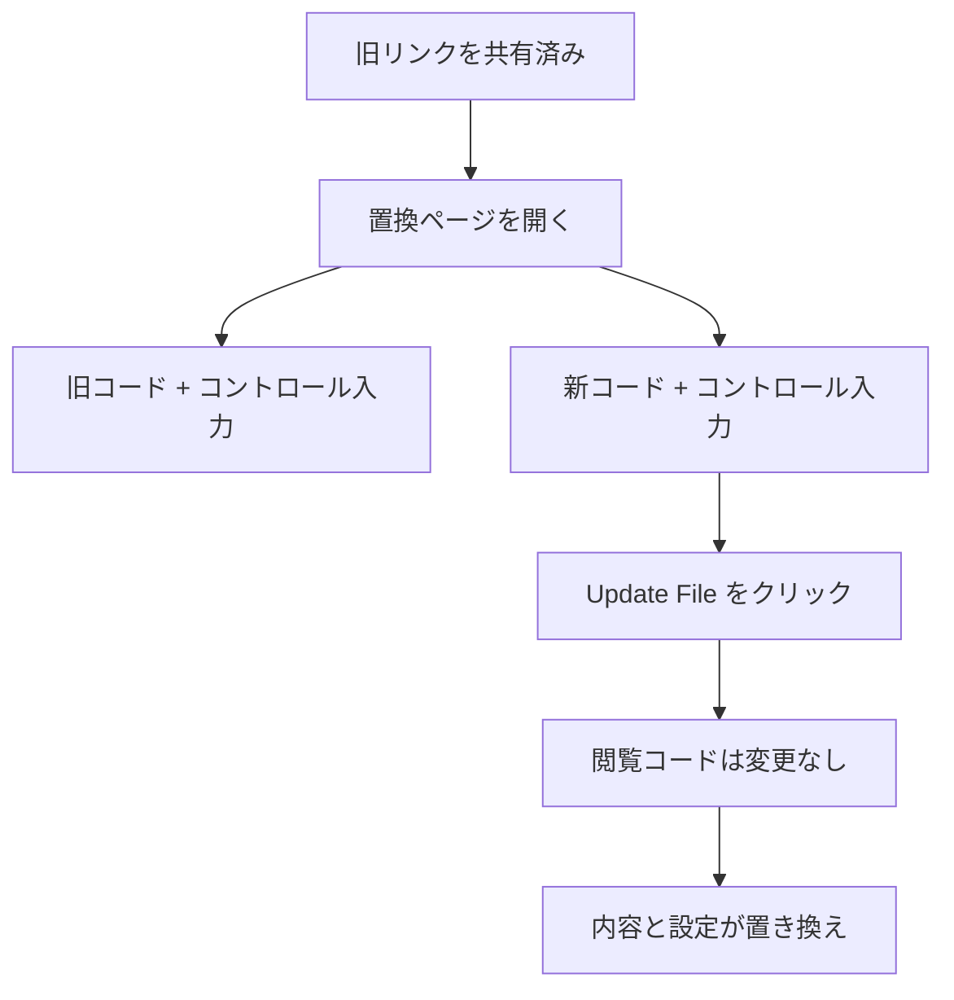

# リンクを変えずにPDFを差し替える

  
<strong>閲覧コードはそのまま。</strong> 内容と設定が新リンクの内容に置き換わります。

## なぜ差し替えるのか

- 送信後に誤字を直したい
- バージョンや価格を更新したい
- 設定を変更したい（回数・時間・認証・DL・透かし・通知）
- 内容を一時的に撤回したい（空白PDFに差し替え）

## MaiPDFの解決方法

MaiPDFはまとめて一括で置き換えます：

- **リンクはそのまま**
- **内容は更新**
- **設定も新リンクに同期**（再設定不要）

## 手順（簡単）

1. 置換ページを開く：https://maipdf.com/pdf/hahachange.php
2. 旧閲覧コード + 旧コントロールコードを入力
3. 新閲覧コード + 新コントロールコードを入力
4. **Update File** をクリック

## 使いどころ

- 契約書の修正
- 価格表の更新
- 研修資料の更新
- 緊急の撤回（空白PDFに差し替え）
