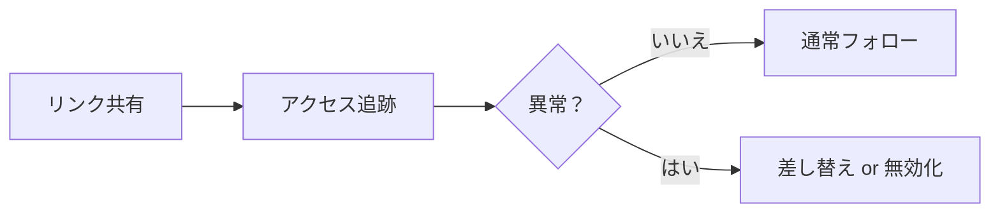

# PDFアクセス追跡と分析（クイックスタート）

  
重要なPDFほど「共有後の見える化」が効きます。適切なタイミングでフォローし、異常アクセスを早期に拾えます。

## まず見るべき3つ

- **初回オープンの時刻**
- **再オープンの回数**
- **端末／IPの概算シグナル**

## 異常が見えたら

- **差し替え**：閲覧コードはそのまま、内容と設定を更新
- **リンク無効化**：必要なら即時に停止

## いちばん簡単な使い方

提案書を送る → 初回オープンを待つ → 文脈付きでフォロー（「見ました？ご質問ありますか？」）。

