# MaiPDF完全紹介：プロフェッショナルなPDF共有プラットフォーム、シンプルで安全

  
<strong>MaiPDF</strong> は、登録不要で素早く共有リンクを生成し、いつでもアクセス権限を制御し、リアルタイムで文書の開封状況を追跡できるプロフェッショナルなオンラインPDF共有プラットフォームです。ビジネス契約、製品マニュアル、チームレポートなど、MaiPDFは文書共有をシンプルで安全、制御可能にします。

## MaiPDFとは？

### プラットフォームの位置づけ

MaiPDFは、シンプルで安全、制御可能な文書共有ソリューションを提供することに焦点を当てた**オンラインPDF共有・管理プラットフォーム**です。

**核心特徴：**
- ✅ **登録不要** - 即座に使用可能、ゼロ障壁
- ✅ **秒級生成** - アップロード後10秒以内にリンク生成
- ✅ **完全無料** - 基本機能は完全無料
- ✅ **プロフェッショナルなセキュリティ** - アクセス制御、透かし保護、データ追跡

### MaiPDF vs 従来の方法

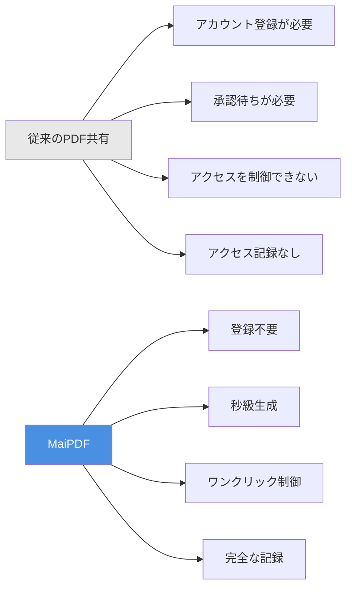

## 核心機能一覧

### 機能アーキテクチャ

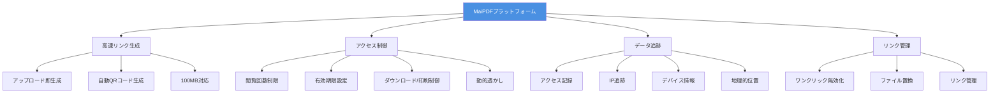

## 完全な使用フロー

### アップロードから共有までの完全フロー

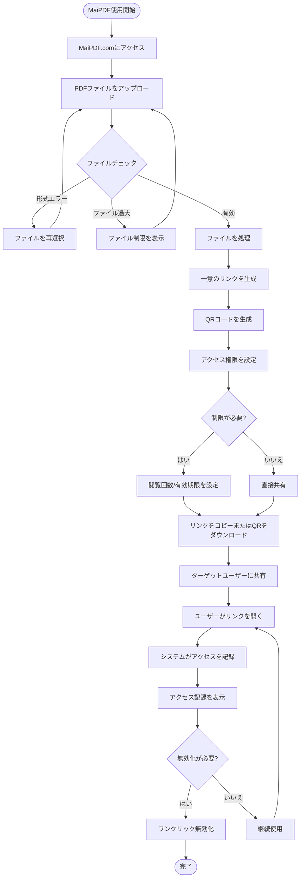

### 3ステップで開始

**ステップ1：PDFをアップロード**
- MaiPDF.comにアクセス
- PDFファイルをドラッグ&ドロップまたは選択
- 最大100MBまで対応

**ステップ2：リンクを生成**
- 共有リンクを自動生成
- QRコードを自動生成
- アクセス権限を設定

**ステップ3：共有して使用**
- リンクをコピーして共有
- またはQRコードをダウンロードして共有
- リアルタイムでアクセス記録を表示

## 核心機能の詳細説明

### 機能1：高速リンク生成

**特徴：**
- ⚡ 秒級生成（通常10秒以内）
- 🔗 一意のリンクを自動生成
- 📱 QRコードを自動生成
- 💾 最大100MBファイルに対応

**フローチャート：**

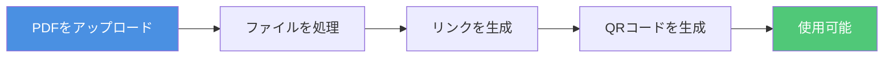

### 機能2：アクセス制御

**制御オプション：**

| 制御 | 説明 | 応用シーン |
|------|------|----------|
| 閲覧回数制限 | PDFが開ける回数を制限 | 契約書、機密資料 |
| 有効期限 | リンクの自動失効を設定 | 一時共有、イベント資料 |
| ダウンロード制御 | PDFダウンロードを許可/禁止 | 著作権保護、拡散防止 |
| 印刷制御 | PDF印刷を許可/禁止 | コピー防止、コンテンツ保護 |
| 動的透かし | 閲覧者情報を表示する透かし | 漏洩追跡、本人確認 |

**アクセス制御フローチャート：**

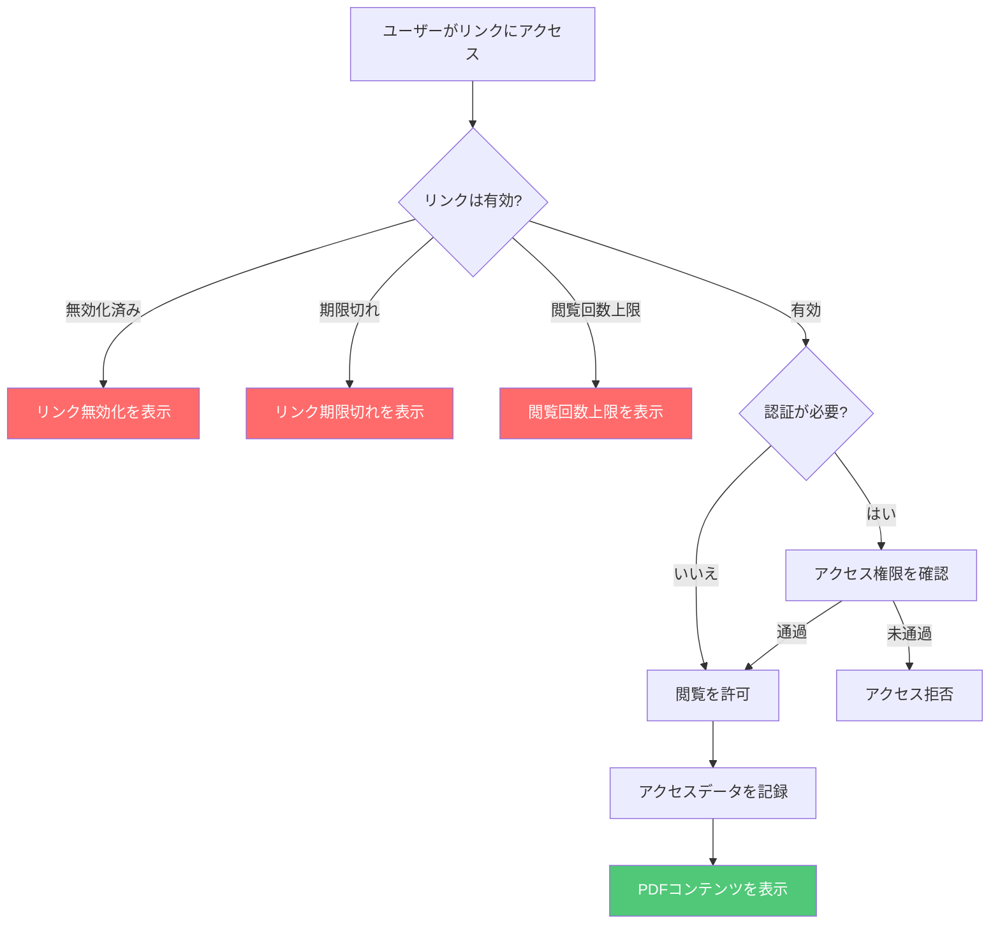

### 機能3：データ追跡

**追跡内容：**
- 📊 総開封回数
- ⏰ 各開封の時刻
- 🌐 訪問者のIPアドレス
- 📱 デバイス情報
- 📍 地理的位置
- 🔗 アクセス元

**データ追跡フローチャート：**

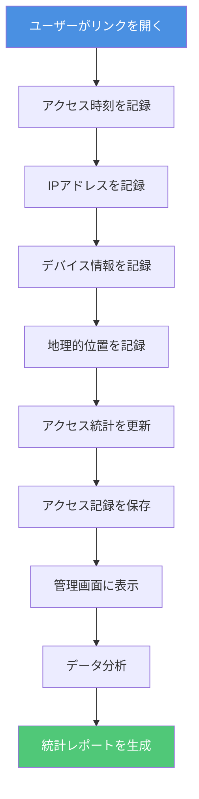

### 機能4：リンク管理

**管理機能：**
- 🚫 ワンクリックリンク無効化
- 🔄 PDFファイルの置換
- 📝 アクセス設定の変更
- 📊 管理画面の表示

**リンク管理フローチャート：**

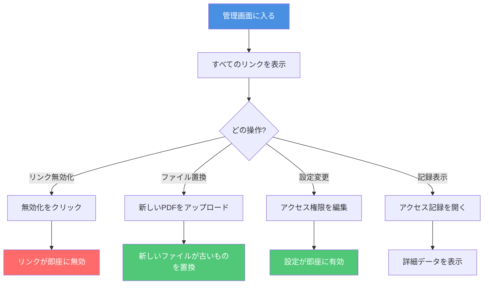

## 応用シーン

### シーン分類図

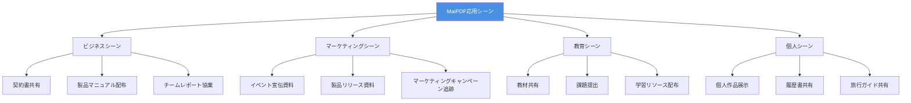

### 典型的な応用シーンフロー

**シーン：ビジネス契約共有**

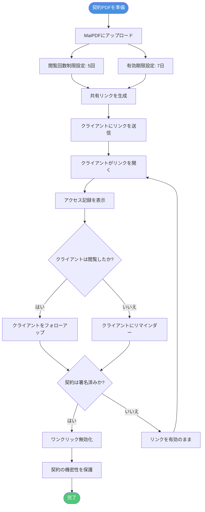

## 機能比較

### MaiPDF vs 従来の方法

| 比較項目 | 従来のPDF共有 | MaiPDF |
|---------|--------------|--------|
| **登録要件** | ❌ アカウントが必要 | ✅ 登録不要 |
| **リンク生成** | ❌ 承認待ちが必要 | ✅ 秒級生成（10秒以内） |
| **アクセス制御** | ❌ 制御不可 | ✅ 完全制御（回数、時間、ダウンロード） |
| **アクセス追跡** | ❌ 記録なし | ✅ 完全な記録（時間、IP、デバイス） |
| **リンク管理** | ❌ 削除のみ可能 | ✅ ワンクリック無効化、ファイル置換 |
| **透かし保護** | ❌ サポートなし | ✅ 動的透かし（オンラインモード） |
| **使用コスト** | 💰 有料の可能性 | ✅ 完全無料 |
| **ファイルサイズ** | 📦 通常小さい | ✅ 最大100MB |

### 機能優位性比較図

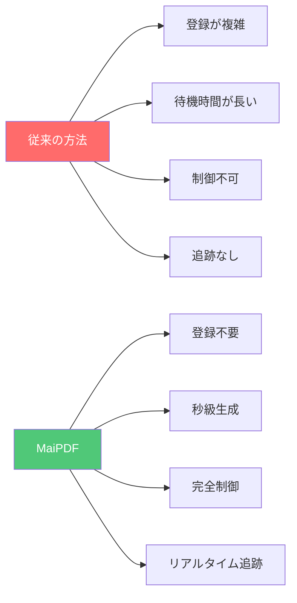

## 使用優位性のまとめ

### 核心優位性

**1. シンプルで使いやすい**
- 登録不要、即座に使用可能
- 3ステップ：アップロード → 生成 → 共有
- クリーンなインターフェース、直感的な操作

**2. 高速で効率的**
- 秒級リンク生成（通常10秒以内）
- 自動QRコード生成
- 大容量ファイル対応（最大100MB）

**3. 安全で制御可能**
- 完全なアクセス制御
- リアルタイムアクセス追跡
- ワンクリックリンク無効化
- 動的透かし保護（オンラインモード）

**4. 完全無料**
- 基本機能は完全無料
- 隠れた費用なし
- 使用制限なし

### 優位性図

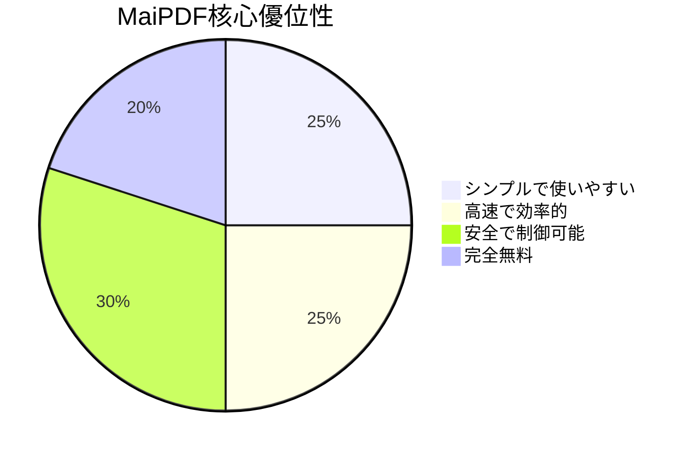

## クイックスタート

### 3ステップで開始

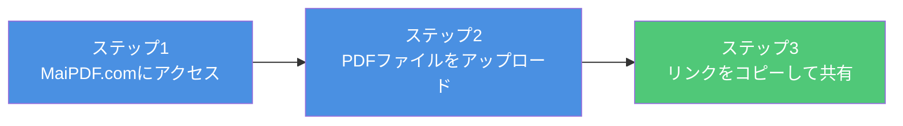

**今すぐ開始：**
1. [MaiPDF.com](https://maipdf.com)にアクセス
2. PDFファイルをアップロードエリアにドラッグ&ドロップ
3. 生成されたリンクをコピーまたはQRコードをダウンロード
4. ターゲットユーザーに共有

## まとめ

MaiPDFは、以下の核心機能により文書共有を簡単にする**プロフェッショナルでシンプル、安全、無料**のPDF共有プラットフォームです：

- ⚡ **高速生成** - 即座にリンク生成、待機不要
- 🔒 **安全制御** - 完全なアクセス制御と権限管理
- 📊 **データ追跡** - リアルタイムアクセス記録と分析
- 🎯 **使いやすい** - 登録不要、3ステップで共有
- 💰 **完全無料** - 基本機能は完全無料で使用可能

ビジネスプロフェッショナル、マーケター、教育者、個人ユーザーを問わず、MaiPDFはプロフェッショナルなPDF共有ソリューションを提供します。

**今すぐ使用開始：** [MaiPDF.comにアクセス](https://maipdf.com)

