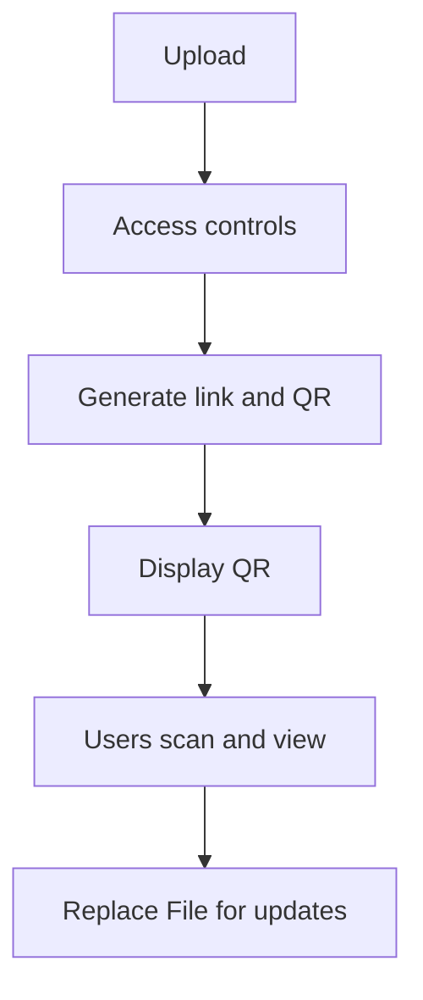

QRコードは「リンクを開くためのショートカット」です。配布や案内で **入力ミスを減らして**アクセスを早くできます。

## 推奨フロー

1. PDF をアップロード
2. 必要ならアクセス制御を設定
3. リンク/QR を生成
4. QR を掲示・印刷して配布
5. 更新は Replace File（リンクとQRを維持）

参考（Replace File）：`https://sendpdfonline.com/article/replace-pdf-without-changing-link-zh`

