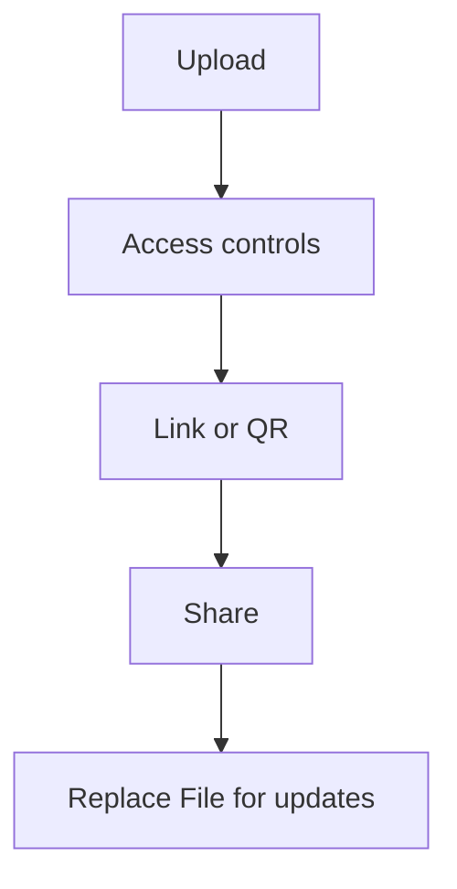

PDF를 메일/메신저 첨부로 보내면 버전이 여러 개로 퍼지기 쉽습니다. 더 깔끔한 방법은 **링크로 공유**하는 것입니다.

## 추천 워크플로우

1. **업로드**
2. **접근 제어 설정** (필요 시)
3. **링크 / QR 생성**
4. **공유**
5. **업데이트는 Replace File** (링크 유지)

> 참고: “만료일/expiration date” 기능이 있다고 가정하지 않습니다.

업데이트 참고: `https://sendpdfonline.com/article/replace-pdf-without-changing-link-zh`

