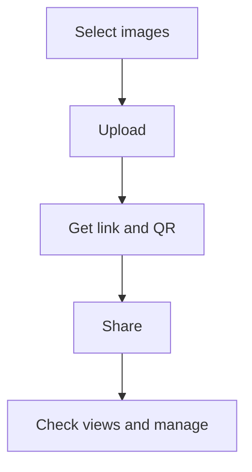

이미지를 빠르게 공유해야 할 때(고객 전달, 이벤트 사진, 팀 협업) 파일을 여러 번 보내는 대신 **하나의 링크**로 정리하면 편합니다.

Maiimg는 **이미지 공유**용 서비스입니다( PDF는 MaiPDF ).

## 기본 흐름

1. 이미지 선택
2. 업로드
3. 링크 / QR 받기
4. 공유
5. 필요 시 조회 확인/관리

```mermaid
flowchart TD
  A[Select images] --> B[Upload]
  B --> C[Get link and QR]
  C --> D[Share]
  D --> E[Check views and manage]
```

