# Maiimg 완전 소개：전문 이미지 공유 플랫폼, 간단하고 안전하게

  
<strong>Maiimg</strong> 는 등록 없이 빠르게 공유 링크를 생성하고, 언제든지 액세스 권한을 제어하며, 실시간으로 이미지 열람 상황을 추적할 수 있는 전문 온라인 이미지 공유 플랫폼입니다. 이벤트 사진, 제품 이미지, 디자인 작품 등, Maiimg는 이미지 공유를 간단하고 안전하며 제어 가능하게 만듭니다.

## Maiimg란 무엇인가?

### 플랫폼 포지셔닝

Maiimg는 간단하고 안전하며 제어 가능한 이미지 공유 솔루션을 제공하는 데 중점을 둔 **온라인 이미지 공유 및 관리 플랫폼**입니다.

**핵심 특징：**
- ✅ **등록 불필요** - 즉시 사용 가능, 제로 장벽
- ✅ **초 단위 생성** - 업로드 후 즉시 링크 생성
- ✅ **완전 무료** - 기본 기능은 완전 무료
- ✅ **전문 보안** - 액세스 제어, 데이터 추적, 일괄 관리

### Maiimg vs 기존 방법

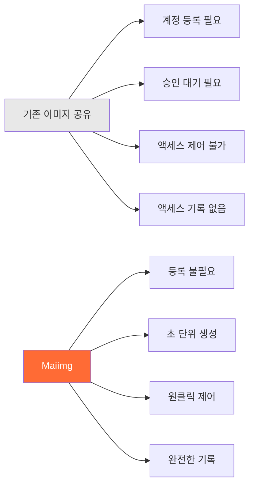

## 핵심 기능 개요

### 기능 아키텍처

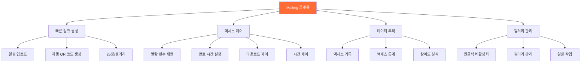

## 완전한 사용 워크플로우

### 업로드부터 공유까지의 완전한 플로우

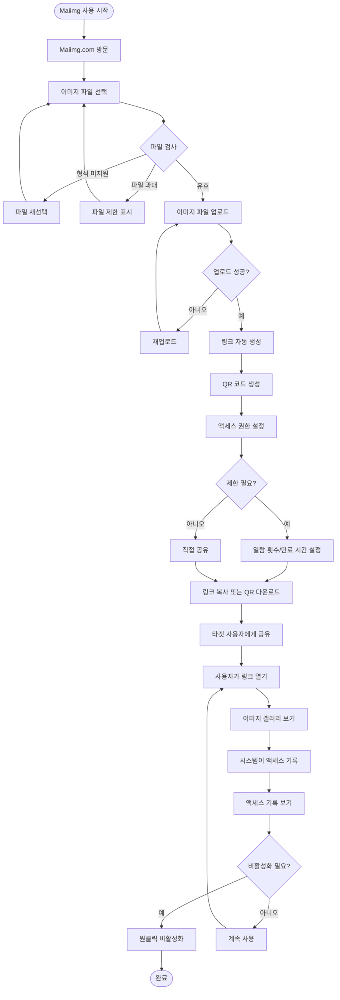

### 3단계로 시작

**단계 1：이미지 업로드**
- Maiimg.com 방문
- 이미지 파일 드래그 앤 드롭 또는 선택
- 일괄 업로드 지원（최대 25장/갤러리）

**단계 2：링크 생성**
- 공유 링크 자동 생성
- QR 코드 자동 생성
- 액세스 권한 설정

**단계 3：공유 및 사용**
- 링크 복사하여 공유
- 또는 QR 코드 다운로드하여 공유
- 실시간으로 액세스 기록 보기

## 핵심 기능 상세 설명

### 기능 1：빠른 링크 생성

**특징：**
- ⚡ 초 단위 생성（업로드 즉시 생성）
- 🔗 고유 링크 자동 생성
- 📱 QR 코드 자동 생성
- 📦 일괄 업로드 지원（최대 25장/갤러리）

**플로우차트：**

### 기능 2：액세스 제어

**제어 옵션：**

| 제어 | 설명 | 응용 시나리오 |
|------|------|-------------|
| 열람 횟수 제한 | 갤러리가 열릴 수 있는 횟수 제한 | 이벤트 사진, 제한 공유 |
| 만료 시간 | 링크 자동 만료 설정 | 임시 공유, 이벤트 자료 |
| 다운로드 제어 | 이미지 다운로드 허용/금지 | 저작권 보호, 확산 방지 |
| 시간 제어 | 액세스 가능한 시간대 설정 | 한정 이벤트, 예정 공개 |

**액세스 제어 플로우차트：**

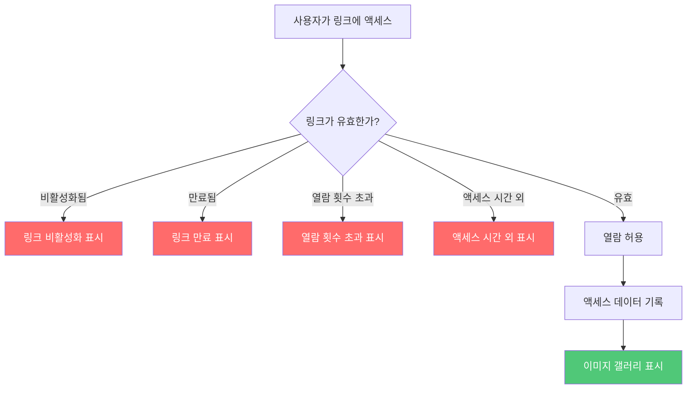

### 기능 3：데이터 추적

**추적 내용：**
- 📊 총 열람 횟수
- ⏰ 각 열람 시간
- 📱 디바이스 정보
- 📈 액세스 트렌드 분석
- 🎯 이미지 참여도 데이터

**데이터 추적 플로우차트：**

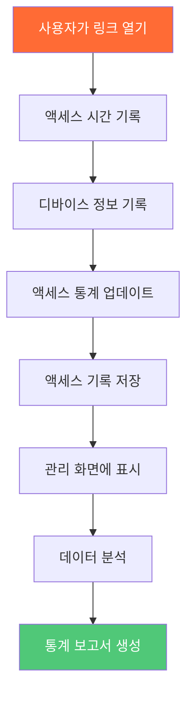

### 기능 4：갤러리 관리

**관리 기능：**
- 🚫 원클릭 링크 비활성화
- 📝 액세스 설정 수정
- 📊 관리 화면 보기
- 🗑️ 갤러리 삭제

**갤러리 관리 플로우차트：**

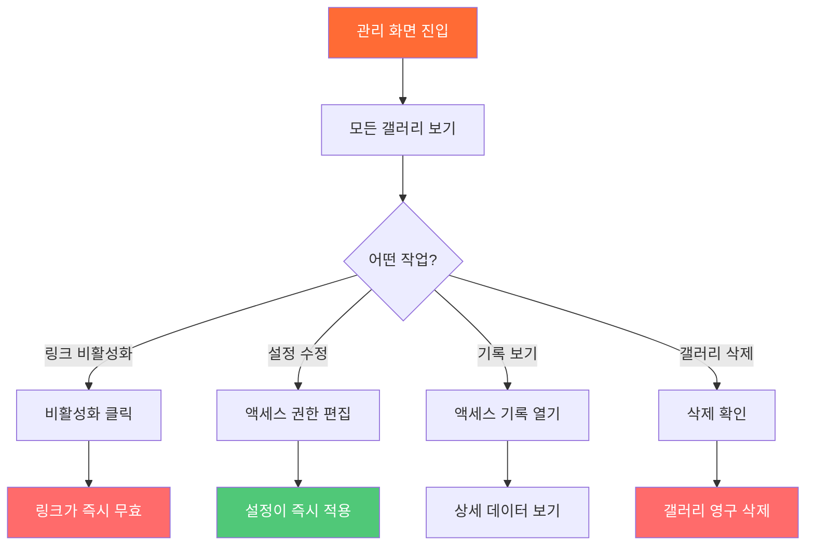

## 응용 시나리오

### 시나리오 분류도

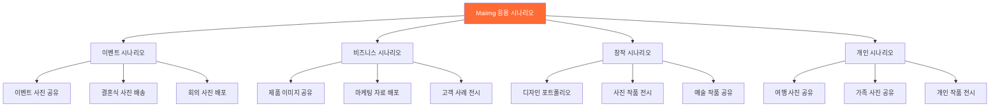

### 전형적인 응용 시나리오 플로우

**시나리오：이벤트 사진 공유**

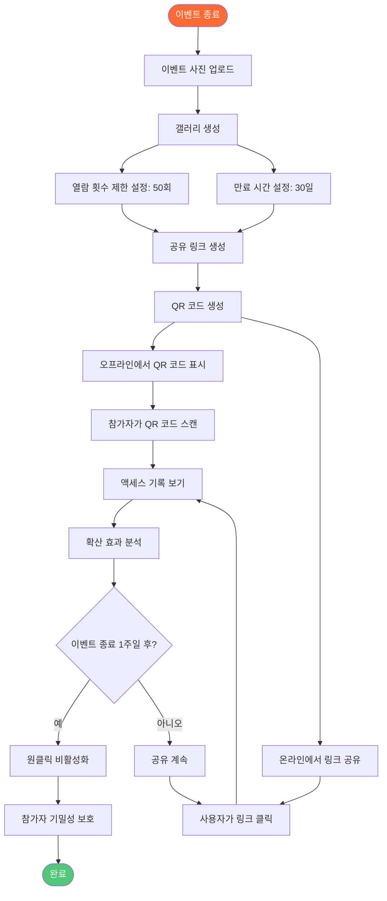

## 기능 비교

### Maiimg vs 기존 방법

| 비교 항목 | 기존 이미지 공유 | Maiimg |
|---------|-----------------|--------|
| **등록 요건** | ❌ 계정 필요 | ✅ 등록 불필요 |
| **링크 생성** | ❌ 승인 대기 필요 | ✅ 초 단위 생성 |
| **액세스 제어** | ❌ 제어 불가 | ✅ 완전 제어（횟수, 시간, 다운로드） |
| **액세스 추적** | ❌ 기록 없음 | ✅ 완전한 기록（시간, 디바이스, 통계） |
| **링크 관리** | ❌ 삭제만 가능 | ✅ 원클릭 비활성화, 설정 수정 |
| **일괄 업로드** | ❌ 단일 업로드 | ✅ 일괄 업로드（25장/갤러리） |
| **사용 비용** | 💰 유료일 수 있음 | ✅ 완전 무료 |
| **작업 복잡도** | 📋 단계가 복잡 | ✅ 간단하고 직관적 |

### 기능 우위 비교도

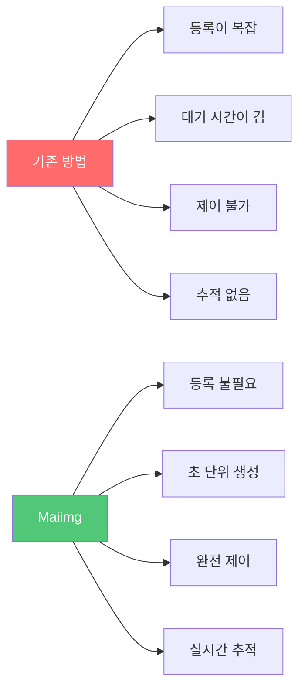

## 사용 우위 요약

### 핵심 우위

**1. 간단하고 사용하기 쉬움**
- 등록 불필요, 즉시 사용 가능
- 3단계：업로드 → 생성 → 공유
- 깔끔한 인터페이스, 직관적인 작업

**2. 빠르고 효율적**
- 초 단위 링크 생성
- 자동 QR 코드 생성
- 일괄 업로드 지원（최대 25장/갤러리）

**3. 안전하고 제어 가능**
- 완전한 액세스 제어
- 실시간 액세스 추적
- 원클릭 링크 비활성화
- 유연한 권한 설정

**4. 완전 무료**
- 기본 기능은 완전 무료
- 숨겨진 비용 없음
- 사용 제한 없음

### 우위도

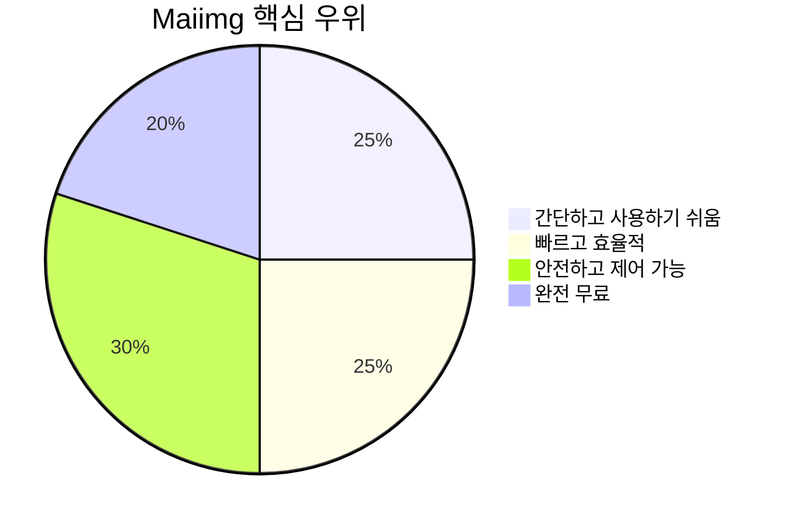

## 빠른 시작

### 3단계로 시작

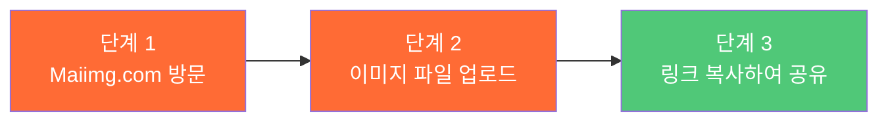

**지금 시작：**
1. [Maiimg.com](https://maiimg.com) 방문
2. 이미지 파일을 업로드 영역에 드래그 앤 드롭
3. 생성된 링크 복사 또는 QR 코드 다운로드
4. 타겟 사용자에게 공유

## 요약

Maiimg는 다음 핵심 기능을 통해 이미지 공유를 쉽게 만드는 **전문적이고 간단하며 안전하고 무료**인 이미지 공유 플랫폼입니다：

- ⚡ **빠른 생성** - 즉시 링크 생성, 대기 불필요
- 🔒 **안전한 제어** - 완전한 액세스 제어 및 권한 관리
- 📊 **데이터 추적** - 실시간 액세스 기록 및 분석
- 🎯 **사용하기 쉬움** - 등록 불필요, 3단계로 공유
- 💰 **완전 무료** - 기본 기능은 완전 무료로 사용 가능

이벤트 주최자, 사진작가, 디자이너, 개인 사용자에 관계없이 Maiimg는 전문 이미지 공유 솔루션을 제공합니다.

**지금 사용 시작：** [Maiimg.com 방문](https://maiimg.com)

