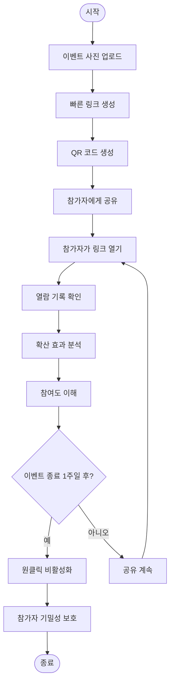
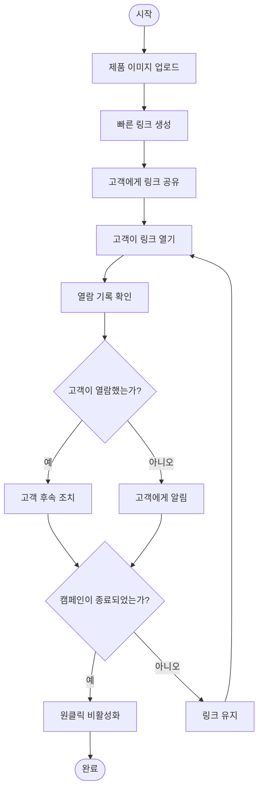
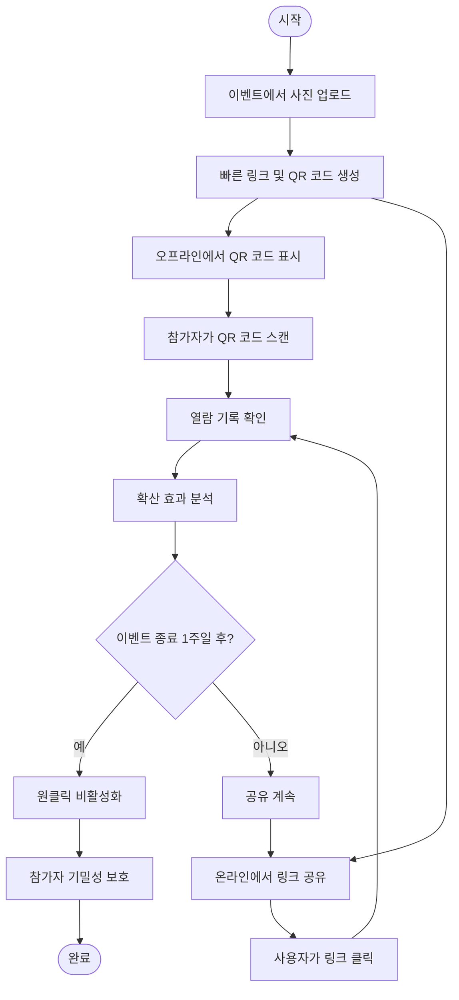

# Maiimg 빠른 링크 생성, 원클릭 비활성화, 열람 기록 확인: 이미지 공유의 3가지 핵심 기능

  
이미지 공유에 필요한 것은? <strong>빠른 링크 생성</strong>, <strong>원클릭 비활성화</strong>, <strong>열람 기록 확인</strong>. Maiimg는 이 3가지 핵심 기능을 완벽하게 결합하여 이미지 공유를 간단하고 안전하며 제어 가능하게 만듭니다.

## 핵심 기능 1: 빠른 링크 생성 공유

### 즉시 생성, 몇 초 만에 완료

**대기 불필요, 즉시 공유:**
- 이미지 업로드 후 링크가 즉시 생성
- 등록 불필요, 승인 대기 불필요
- 일괄 업로드 지원 (최대 25장)
- QR 코드 자동 생성

**작업 단계:**
1. Maiimg.com 방문
2. 이미지 드래그 앤 드롭 또는 선택
3. **링크가 자동 생성**, 즉시 사용 가능
4. 링크 복사 또는 QR 코드 다운로드하여 공유

## 핵심 기능 2: 원클릭 비활성화

### 언제든지 제어, 즉시 적용

**원클릭 작업, 링크가 즉시 무효:**
- "비활성화" 버튼 클릭, 링크가 즉시 사용 불가
- 이미지를 삭제할 필요 없이 링크만 비활성화
- 공유된 링크가 즉시 무효

## 핵심 기능 3: 열람 기록 확인

### 실시간 추적, 데이터 투명성

**완전한 액세스 기록:**
- 총 열람 횟수 확인
- 각 열람 시간 확인
- 열람자 IP 주소 확인 (지원되는 경우)
- 디바이스 정보 확인 (지원되는 경우)

## 3가지 기능이 완벽하게 결합

### 완전한 워크플로우

**시나리오: 이벤트 사진 공유**

**프로세스:**

1. **빠른 링크 생성**
   - 이벤트 종료, 사진을 즉시 업로드
   - 링크가 몇 초 만에 생성
   - 참가자에게 공유

2. **열람 기록 확인**
   - 실시간으로 누가 링크를 열었는지 확인
   - 사진 확산 효과 이해
   - 참가자 참여도 분석

3. **원클릭 비활성화**
   - 이벤트 종료 1주일 후
   - 원클릭으로 링크 비활성화
   - 참가자 기밀성 보호

### 기능 비교표

| 기능 | 기존 이미지 공유 | Maiimg |
|------|-----------------|--------|
| 링크 생성 속도 | 등록 필요, 승인 대기 | 몇 초 만에 생성, 등록 불필요 |
| 링크 제어 | 비활성화 불가, 삭제만 가능 | 원클릭 비활성화, 언제든지 제어 |
| 열람 기록 | 기록 없음 또는 불완전 | 완전한 기록, 실시간 확인 |
| 사용 비용 | 유료일 수 있음 | 완전 무료 |
| 작업 복잡도 | 단계가 복잡 | 간단하고 직관적 |

## 실제 사용 사례

### 사례 1: 전자상거래 제품 이미지 공유

**요구사항:** 고객에게 제품 이미지를 빠르게 공유, 열람 상황 이해, 캠페인 후 액세스 종료

**솔루션:**
1. 제품 이미지 업로드, **빠른 링크 생성**
2. 고객에게 링크 공유
3. **열람 기록 확인**, 고객 열람 상황 이해
4. 캠페인 종료 후, **원클릭으로 링크 비활성화**

### 사례 2: 이벤트 사진 즉시 공유

**요구사항:** 이벤트에서 즉시 사진 공유, 확산 효과 추적, 이벤트 후 기밀성 보호

**솔루션:**
1. 이벤트에서 사진 업로드, **빠른 링크 및 QR 코드 생성**
2. 참가자가 QR 코드를 스캔하여 열람
3. **열람 기록 확인**, 사진 확산 효과 이해
4. 이벤트 종료 1주일 후, **원클릭으로 링크 비활성화**

