# MaiPDF 완전 소개：전문 PDF 공유 플랫폼, 간단하고 안전하게

  
<strong>MaiPDF</strong> 는 등록 없이 빠르게 공유 링크를 생성하고, 언제든지 액세스 권한을 제어하며, 실시간으로 문서 열람 상황을 추적할 수 있는 전문 온라인 PDF 공유 플랫폼입니다. 비즈니스 계약, 제품 매뉴얼, 팀 보고서 등, MaiPDF는 문서 공유를 간단하고 안전하며 제어 가능하게 만듭니다.

## MaiPDF란 무엇인가?

### 플랫폼 포지셔닝

MaiPDF는 간단하고 안전하며 제어 가능한 문서 공유 솔루션을 제공하는 데 중점을 둔 **온라인 PDF 공유 및 관리 플랫폼**입니다.

**핵심 특징：**
- ✅ **등록 불필요** - 즉시 사용 가능, 제로 장벽
- ✅ **초 단위 생성** - 업로드 후 10초 이내에 링크 생성
- ✅ **완전 무료** - 기본 기능은 완전 무료
- ✅ **전문 보안** - 액세스 제어, 워터마크 보호, 데이터 추적

### MaiPDF vs 기존 방법

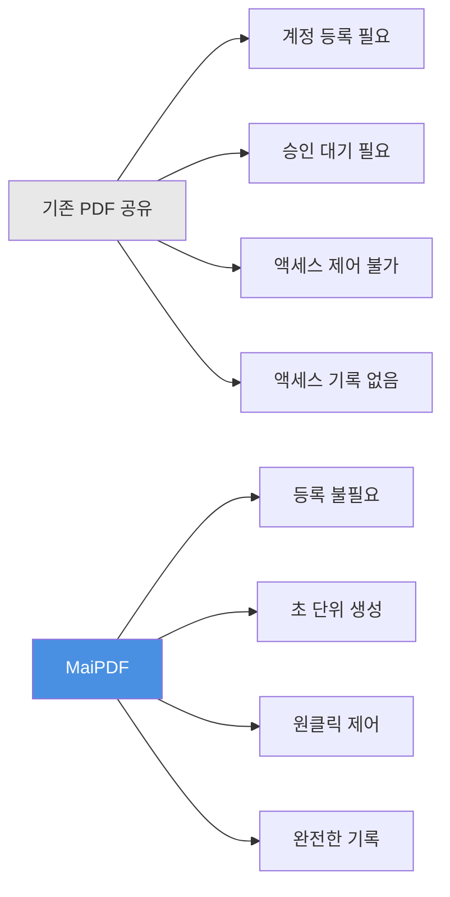

## 핵심 기능 개요

### 기능 아키텍처

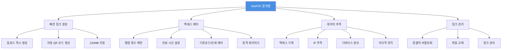

## 완전한 사용 워크플로우

### 업로드부터 공유까지의 완전한 플로우

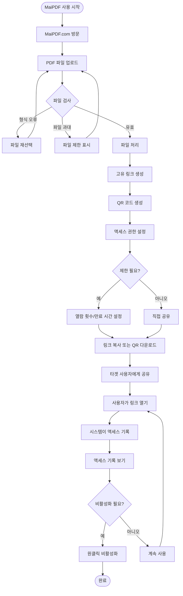

### 3단계로 시작

**단계 1：PDF 업로드**
- MaiPDF.com 방문
- PDF 파일 드래그 앤 드롭 또는 선택
- 최대 100MB까지 지원

**단계 2：링크 생성**
- 공유 링크 자동 생성
- QR 코드 자동 생성
- 액세스 권한 설정

**단계 3：공유 및 사용**
- 링크 복사하여 공유
- 또는 QR 코드 다운로드하여 공유
- 실시간으로 액세스 기록 보기

## 핵심 기능 상세 설명

### 기능 1：빠른 링크 생성

**특징：**
- ⚡ 초 단위 생성（보통 10초 이내）
- 🔗 고유 링크 자동 생성
- 📱 QR 코드 자동 생성
- 💾 최대 100MB 파일 지원

**플로우차트：**

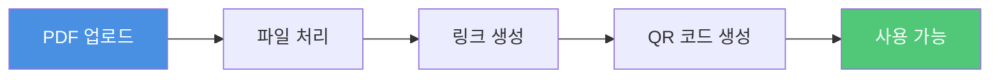

### 기능 2：액세스 제어

**제어 옵션：**

| 제어 | 설명 | 응용 시나리오 |
|------|------|-------------|
| 열람 횟수 제한 | PDF가 열릴 수 있는 횟수 제한 | 계약서, 기밀 자료 |
| 만료 시간 | 링크 자동 만료 설정 | 임시 공유, 이벤트 자료 |
| 다운로드 제어 | PDF 다운로드 허용/금지 | 저작권 보호, 확산 방지 |
| 인쇄 제어 | PDF 인쇄 허용/금지 | 복사 방지, 콘텐츠 보호 |
| 동적 워터마크 | 열람자 정보를 표시하는 워터마크 | 유출 추적, 신원 확인 |

**액세스 제어 플로우차트：**

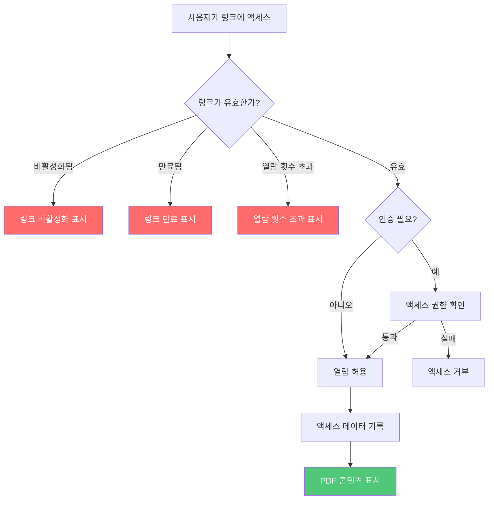

### 기능 3：데이터 추적

**추적 내용：**
- 📊 총 열람 횟수
- ⏰ 각 열람 시간
- 🌐 방문자 IP 주소
- 📱 디바이스 정보
- 📍 지리적 위치
- 🔗 액세스 소스

**데이터 추적 플로우차트：**

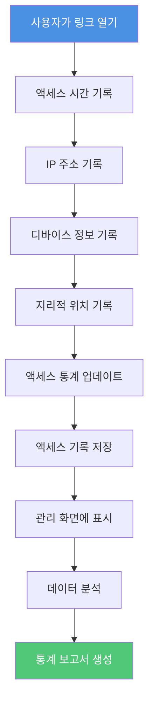

### 기능 4：링크 관리

**관리 기능：**
- 🚫 원클릭 링크 비활성화
- 🔄 PDF 파일 교체
- 📝 액세스 설정 수정
- 📊 관리 화면 보기

**링크 관리 플로우차트：**

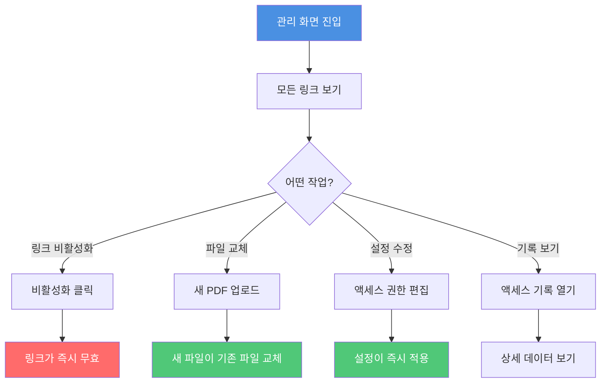

## 응용 시나리오

### 시나리오 분류도

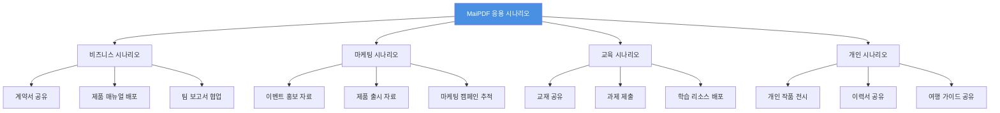

### 전형적인 응용 시나리오 플로우

**시나리오：비즈니스 계약 공유**

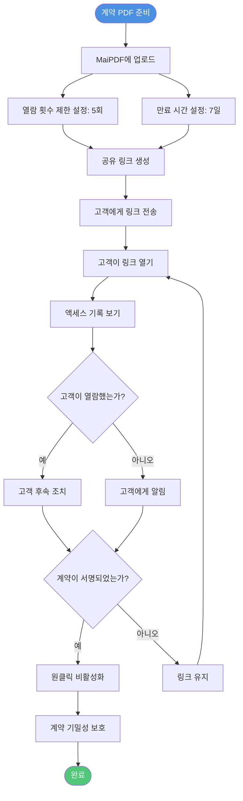

## 기능 비교

### MaiPDF vs 기존 방법

| 비교 항목 | 기존 PDF 공유 | MaiPDF |
|---------|--------------|--------|
| **등록 요건** | ❌ 계정 필요 | ✅ 등록 불필요 |
| **링크 생성** | ❌ 승인 대기 필요 | ✅ 초 단위 생성（10초 이내） |
| **액세스 제어** | ❌ 제어 불가 | ✅ 완전 제어（횟수, 시간, 다운로드） |
| **액세스 추적** | ❌ 기록 없음 | ✅ 완전한 기록（시간, IP, 디바이스） |
| **링크 관리** | ❌ 삭제만 가능 | ✅ 원클릭 비활성화, 파일 교체 |
| **워터마크 보호** | ❌ 지원 없음 | ✅ 동적 워터마크（온라인 모드） |
| **사용 비용** | 💰 유료일 수 있음 | ✅ 완전 무료 |
| **파일 크기** | 📦 보통 작음 | ✅ 최대 100MB |

### 기능 우위 비교도

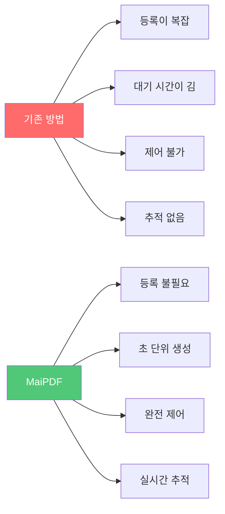

## 사용 우위 요약

### 핵심 우위

**1. 간단하고 사용하기 쉬움**
- 등록 불필요, 즉시 사용 가능
- 3단계：업로드 → 생성 → 공유
- 깔끔한 인터페이스, 직관적인 작업

**2. 빠르고 효율적**
- 초 단위 링크 생성（보통 10초 이내）
- 자동 QR 코드 생성
- 대용량 파일 지원（최대 100MB）

**3. 안전하고 제어 가능**
- 완전한 액세스 제어
- 실시간 액세스 추적
- 원클릭 링크 비활성화
- 동적 워터마크 보호（온라인 모드）

**4. 완전 무료**
- 기본 기능은 완전 무료
- 숨겨진 비용 없음
- 사용 제한 없음

### 우위도

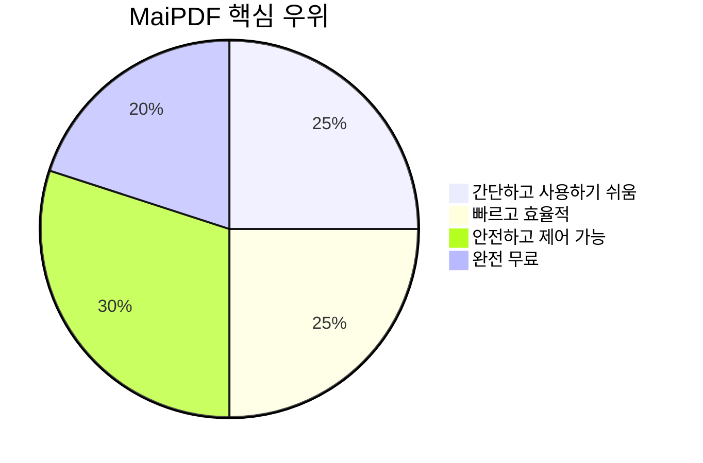

## 빠른 시작

### 3단계로 시작

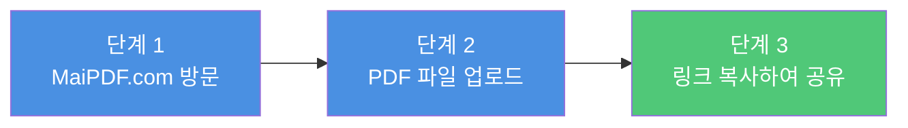

**지금 시작：**
1. [MaiPDF.com](https://maipdf.com) 방문
2. PDF 파일을 업로드 영역에 드래그 앤 드롭
3. 생성된 링크 복사 또는 QR 코드 다운로드
4. 타겟 사용자에게 공유

## 요약

MaiPDF는 다음 핵심 기능을 통해 문서 공유를 쉽게 만드는 **전문적이고 간단하며 안전하고 무료**인 PDF 공유 플랫폼입니다：

- ⚡ **빠른 생성** - 즉시 링크 생성, 대기 불필요
- 🔒 **안전한 제어** - 완전한 액세스 제어 및 권한 관리
- 📊 **데이터 추적** - 실시간 액세스 기록 및 분석
- 🎯 **사용하기 쉬움** - 등록 불필요, 3단계로 공유
- 💰 **완전 무료** - 기본 기능은 완전 무료로 사용 가능

비즈니스 전문가, 마케터, 교육자, 개인 사용자에 관계없이 MaiPDF는 전문 PDF 공유 솔루션을 제공합니다.

**지금 사용 시작：** [MaiPDF.com 방문](https://maipdf.com)

