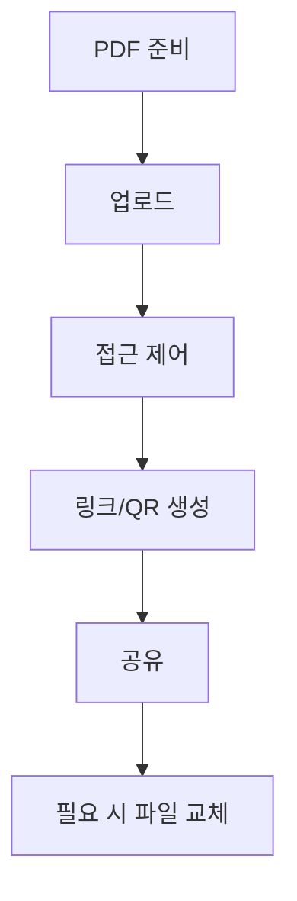

회의 자료나 안내문 PDF를 공유할 때, 파일을 여기저기 보내면 버전 관리가 어려워집니다.  
MaiPDF에서는 **PDF를 업로드 → 링크/QR 생성 → 공유** 흐름으로 정리할 수 있습니다.

## 추천 흐름

1. **PDF 업로드**
2. **접근 제어 설정**(필요할 때만)
3. **링크/QR 생성**
4. **공유**
5. **업데이트는 “파일 교체(Replace File)”**(링크 유지)

> 참고: “만료일(expiration date) 설정” 같은 기능은 전제로 쓰지 않습니다.

업데이트가 필요하면 **Replace File**로 새 버전을 올리고 링크는 그대로 유지하는 방식이 실무에서 편합니다.  
참고: `https://sendpdfonline.com/article/replace-pdf-without-changing-link-zh`

