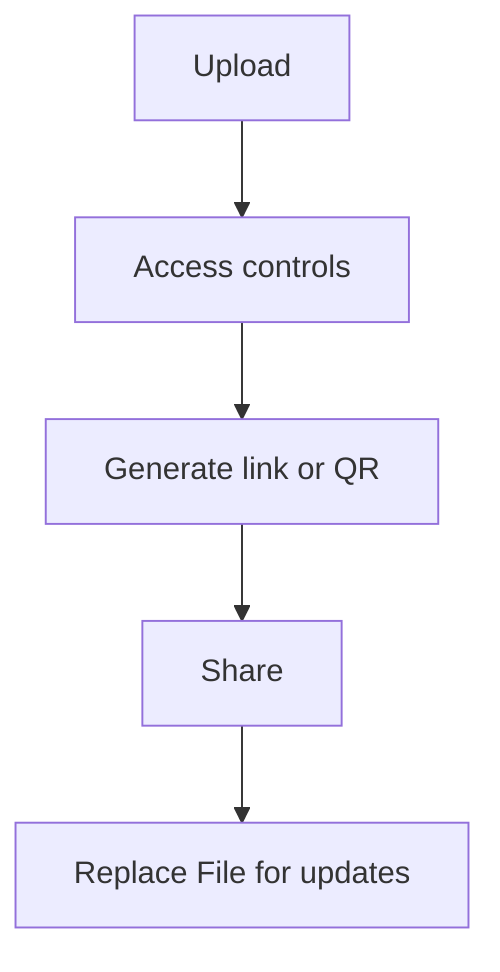

If you share a PDF as an attachment, copies spread fast. A cleaner approach is **sharing a link** and using **view-only style** access where appropriate.

This page keeps it practical and avoids over-claiming: you can reduce casual downloading, but **you can’t stop screenshots**.

## Recommended workflow

1. **Upload**
2. **Set access controls** (only if needed)
3. **Generate a link / QR**
4. **Share**
5. **Replace File for updates** (keep the same link)

> Note: we don’t assume an “expiration date” setting exists.

## Screenshots

## Add a deterrent (optional)

If your workflow supports it, a watermark can discourage casual forwarding.

## Update without changing the link

Reference: `https://sendpdfonline.com/article/replace-pdf-without-changing-link-zh`

